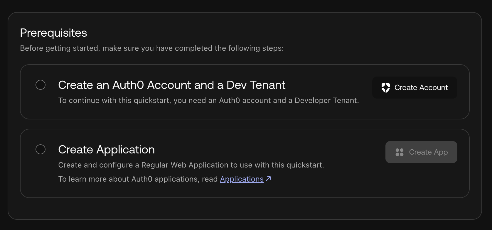
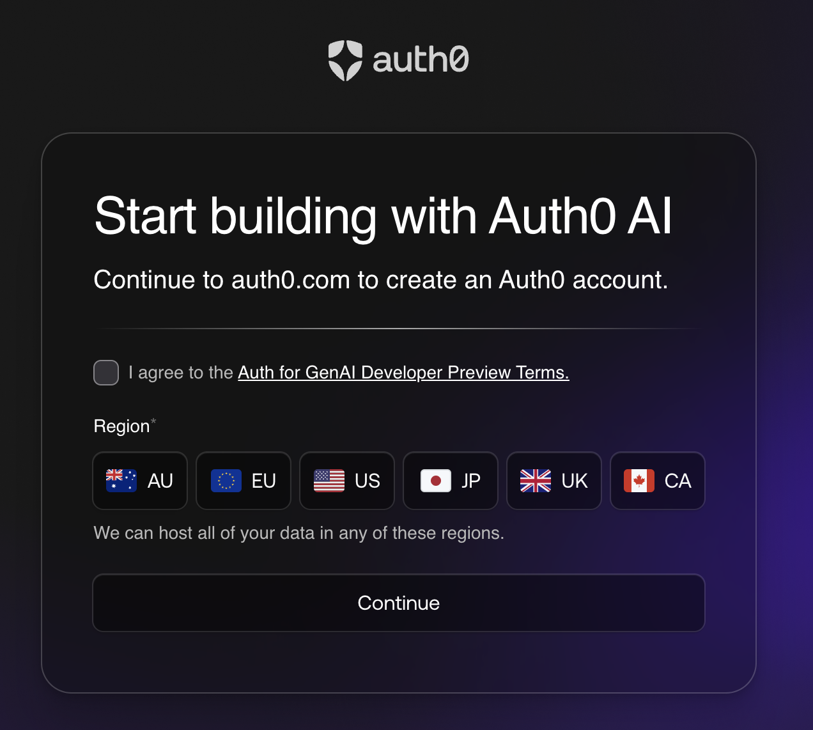

# Introduction to Tool Calling and Assistant0 set up

Let's get started! Our assistant named Assistant0 is an AI personal assistant that consolidates your digital life by dynamically accessing multiple tools to help you stay organized and efficient.

It is built in NextJS and we'll add tool calling to it to make it more powerful.

## What is tool calling

Tool calling is the way we call the integrations your GenAI-powered application has in order to gain some ability to interact with external services, for example, interface with Gmail and Google Calendar to help you speedily draft emails and schedule meetings. It allows your AI agent to go beyond its pre-trained knowledge and interact with the real world, access private data securely, and perform actions on behalf of the user.

## Integrations we will implement during the workshop

We are going to add two integrations:

1. **Calculator**: So our assistant can learn how to do calculations; and
1. **Gmail Integration**: The assistant can scan your inbox to generate concise summaries. It can highlight urgent emails, categorizes conversations by importance, and even suggests drafts for quick replies.

## Set Up

We recommend using GitHub Codespaces for this workshop and the steps are outline below.

You can find instructions for other coding environments on the [README.md](TODO) of the parent repository.

### Environment Set Up

1. Navigate to the repository on GitHub.
2. Click the green **Code** button, then select the **Codespaces** tab.
3. Click **Create codespace on main** to start a new Codespace.
4. Wait for the `postCreateCommand` finish and the Codespace to complete the setup, this might take about **2~3 minutes**.
    1. The Codespace setup will create the python environments and install the necessary dependencies.
5. OpenAI account:
  * Make sure you have an [OpenAI account and an OpenAI API key](https://platform.openai.com/docs/libraries#create-and-export-an-api-key).
  * Save the OpenAI API key to your `.env.local`.

Once the Codespace is ready and you have your OpenAI API key in `.env.local`, you'll be ready continue on.

### Setting up your Auth0 account

For this workshop you'll need an Auth0 account and a new Tenant specific for GenAI. Since Auth for GenAI is in Developer Preview for the moment so you'll need a new tentant as it will enable and configure some Auth0 features for you.

[Navigate to this page](https://auth0.com/ai/docs/user-authentication) and follow the first two pre-requisites steps in the image below.

Once you click **Create Account** you can also login to your account but you'll have to accept the terms and conditions and chose the region for your new tentant.

These will help you Create a new tentant with Auth for GenAI enabled and also setup your application in the Auth0 Dashboard.

---

With these completed you are ready for [the next step](01-running-the-app.md).