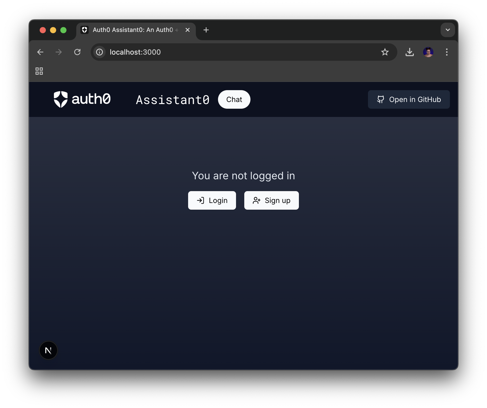

# Running Assistant0 for the first time and setting up auth

_Requirements_: Have completed "[Introduction to tool calling and application set up](00-intro-and-setup.md)" section.

Assistant0 is built in NextJS and already has all the dependencies installed for you to start using it, including the the [Auth0 NextJS SDK](https://auth0.com/docs/quickstart/webapp/nextjs/01-login#install-the-auth0-next-js-sdk) to take care of auth for you. If you want to understand [how auth was setup check out this blog post](https://auth0.com/blog/genai-tool-calling-build-agent-that-calls-gmail-securely-with-langgraph-vercelai-nextjs/).

For the GenAI portion we are going to use [LangGraph](https://www.langchain.com/langgraph).

## Understanding the code

This is the application structure:

- `src/app`: Contains the Next.js application routes, layout, and pages.
- `src/app/page.tsx`: Home page with chat interface.
- `src/app/api/chat/route.ts`: API route for handling chat requests. This is where the AI agent is defined.
- `src/components`: UI components used in the application.
- `src/lib`: Services and configurations. This is where custom tools will be defined.
- `src/utils`: Utility functions
- `.env.local`: File to hold the environment variables

## Adding Web App Configuration Variables to `.env.local`

In the [Auth0 Dashboard](https://manage.auth0.com/#/applications) you should see a two applications:

1. Default App; and
1. WebApp Quickstart Client.

We are going to use the second as it was created and setup for us in the past step. Click on _WebApp Quickstart Client_ and in the **Settings** tab you are going to copy 3 values to update the `.env.local` file like so:

1. Copy the **Domain** and update the `AUTH0_DOMAIN`;
1. Copy the **Client ID** and updae the `AUTH0_CLIENT_ID`;
1. Copy the **Client Secret** and updae the `AUTH0_CLIENT_SECRET`.

Now to finalize the update to the `.env.local` file, you need to generate a secret. Open the terminal and run the following command:

```sh
openssl rand -hex 32
```

Copy the output and update the `AUTH0_SECRET` with that value.

## Running Assistant0 for the first time

Now to start things run your application with the command below:

```sh
npm run dev
# or
bun dev
```

And access [http://localhost:3000](http://localhost:3000), and you should see something like the image below:



Once the page open sign up or log in and you should see the chat window:


---

With these completed you are ready for [the next step](02-tool-calling-calculator.md).