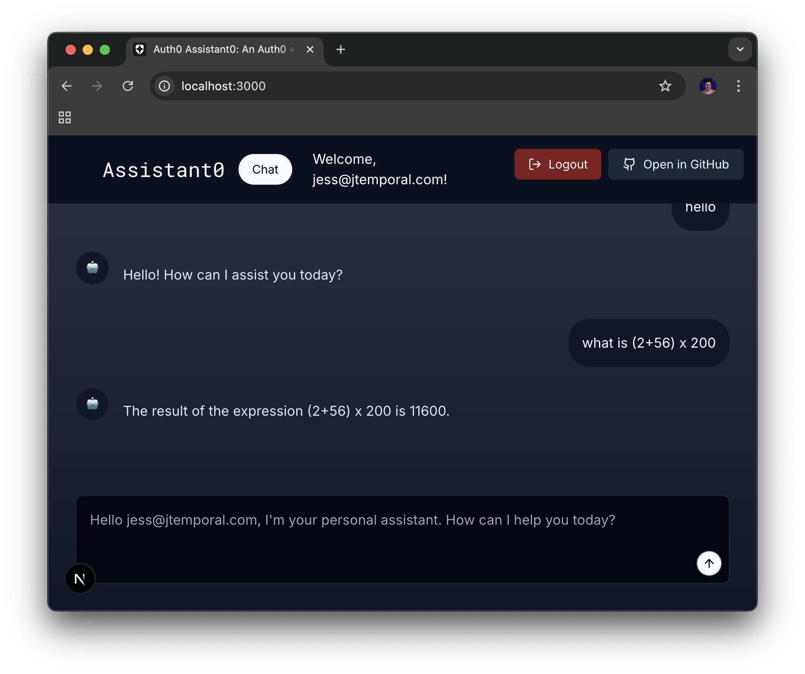

# Adding the first tool calling feature: A calculator

As a practice implementing a tool call let's add a calculator so our assistant knows how to do math.

## Updating the Agent

The agent code is implementend in the `src/api/chat/route.ts`. To add a calculator you'll need a LangChain community tool. Since this dependency is already installed you can import it.

Open `src/api/chat/route.ts` and update the list of imports:

```ts
// src/api/chat/route.ts
import { Calculator } from "@langchain/community/tools/calculator";
```

To then use this as part of the tools you'll need to update the `POST` function. This function takes care of all post requests from our chat. (TODO check this)

Then in the `POST` function, right before the `llm` variable let's add a `tools` constant like this:

```ts
// src/api/chat/route.ts
// ...
export async function POST(req: NextRequest) {
  // ...
  const tools = [new Calculator()];
  // const llm...
}
```

You'll also need to update the agent creation to remove the default empty array from this:

```ts
// src/api/chat/route.ts
// ...
const agent = createReactAgent({
      llm,
      tools: [],
      //...
```

to this:

```ts
// src/api/chat/route.ts
// ...
const agent = createReactAgent({
      llm,
      tools,
      //...
```

If your server is not running, run it then try asking the assistant to perform some calculations. For example: "_what is (2+56) x 200_".

You should see the answer in the UI. If you check the terminal where the development server is running, you should see the tool calling data like below:

```txt
Tool calls state: {
 "call_E3Za9klJcJ5TADWiMj8XfjdB": {
   "name": "calculator",
   "args": "{\n  \"input\": \"(2+56) * 200\"\n}"
 }
}
POST /api/chat 200 in 8382ms
```

And you should see the answer in the chat window like so:



---

With these completed you are ready for [the next step](03-tool-calling-gmail.md).