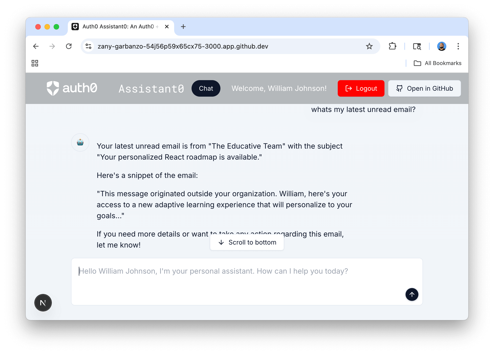

# Adding the second tool calling feature: Gmail

Now for the exciting part! Let's  Actually add the Gmail tool in Assistant0 so it can interact with Gmail. 

You already did most of the hard work: setting up a Google Cloud Project to get API credentials, configuring Auth0 to handle the authentication flow securely with Google. Now is time to update the agent code to use the Gmail tool.

All of this you've done so the application doesn't handle user Google credentials directly. Instead, Auth0 will manage the OAuth 2.0 flow with Google.

When a user wants to use the Gmail integration, they'll be redirected to Google to grant permission. Auth0 will then securely store the necessary tokens (access and refresh tokens) in the [Token Vault](https://auth0.com/docs/secure/tokens/token-vault).

Our AI agent, through the Auth0 AI SDK, will then request these tokens from Auth0 to make authenticated API calls to Gmail on the user's behalf. This keeps sensitive credentials out of our application code and gives users control over what the AI can access.

## Auth0 Token Vault

First, we need to get an access token for the Gmail API. We can get this using the Auth0 Token Vault.

Now you need to do some updates the `auth0-ai.ts` file. Start by adding the new imports:

```ts
// src/lib/auth0-ai.ts
import { getRefreshToken } from '@/lib/auth0';
import { Auth0AI } from '@auth0/ai-langchain';
// import ...
```

The first import is gets the function for retrieving refresh tokens. While the second import uses the Auth0 AI LangChain SDK to import a `Auth0AI` a constructor that facilitates using Auth0 with LangChain.

Now iniatialize the `auth0AI` and then create the connection with Google.
```ts
// ... previous code
const auth0AI = new Auth0AI();

// Connection for Google services
export const withGoogleConnection = auth0AI.withTokenForConnection({
  connection: 'google-oauth2',
  scopes: ['https://www.googleapis.com/auth/gmail.readonly', 'https://www.googleapis.com/auth/gmail.compose'],
  refreshToken: getRefreshToken,
});
```

Here we pass the scopes and the type of connection.

Keep in mind that you'll need to "login/sign up with Google" on Assistant0 in order to leverage this feature.

## Look for emails

In order to read your emails in the Assistant0 chat you'll also need to update the agent code. So open `src/app/api/chat/routes.ts` next to update the tool calling portion

First start with the imports:

```ts
import { GmailSearch } from '@langchain/community/tools/gmail';
import { withGoogleConnection, getAccessToken } from '@/lib/auth0-ai';
```

The `GmailSearch` is used to do the actual look up in your inbox.

Then in the `POST` function, right before the `tools` variable let's add a `gmailParams` and update the list of tools like this:

```ts
// src/app/api/chat/route.ts
// ...
export async function POST(req: NextRequest) {
    // ...
    // 👇 new code
    // Provide the access token to the Gmail tools
    const gmailParams = {
      credentials: {
        accessToken: getAccessToken,
      },
    };
    // 👆 new code
    // 👇 updated code
    const tools = [
      new Calculator(),
      withGoogleConnection(new GmailSearch(gmailParams)),
    ];
    // 👆 updated code
    // const llm...
}
```

Now test it!

If your server is not running run `npm run dev`. Open your app, log in with Google, and try a prompt like: "Check my last unread email?"



And you should see this call on the terminal running your server:

```txt
Tool calls state: {
  "call_Hp6nEUWanAyom7Uqc36YB4Ts": {
    "name": "search_gmail",
    "args": "{\"query\":\"is:unread\",\"maxResults\":1,\"resource\":\"messages\"}"
  }
}
 POST /api/chat 200 in 1685ms
```

## Drafting emails

Now that is all fine and well but the idea is to also draft emails for you, so let's add another tool.

First update the list of imports:

```ts
import { GmailSearch, GmailCreateDraft } from '@langchain/community/tools/gmail';
```

The `GmailCreateDraft` is used to draft emails for you.

Then in the `POST` function, update the `tools` variable land add the new draft tool like this:

```ts
// src/app/api/chat/route.ts
// ...
export async function POST(req: NextRequest) {
    // ...
    // 👇 updated code
    const tools = [
      new Calculator(),
      withGoogleConnection(new GmailSearch(gmailParams)),
      withGoogleConnection(new GmailCreateDraft(gmailParams)),
    ];
    // 👆 updated code
    // const llm...
}
```

And once you save the file you can ask Assistant0 to draft a response for you with the prompt "Now draft an email to (insert email here) with this subject and this message"


And you should the log of the tool call on your terminal running the server like so:

```txt
Tool calls state: {
  "call_WtRe1LFmMjnpUHQd4ia7u5g4": {
    "name": "create_gmail_draft",
    "args": "{\"...\"}"
  }
}
 POST /api/chat 200 in 3558ms
```

---

With these you completed the workshop and are now ready for [the recap](05-recap.md).
